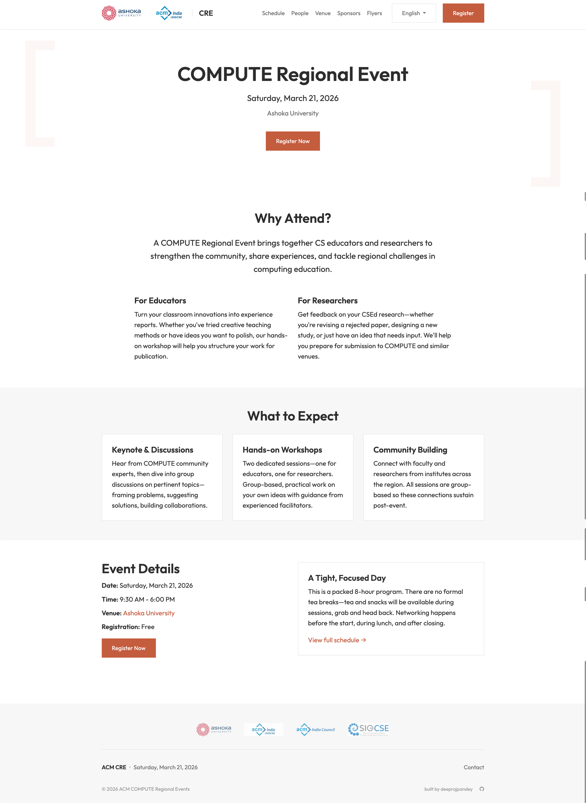
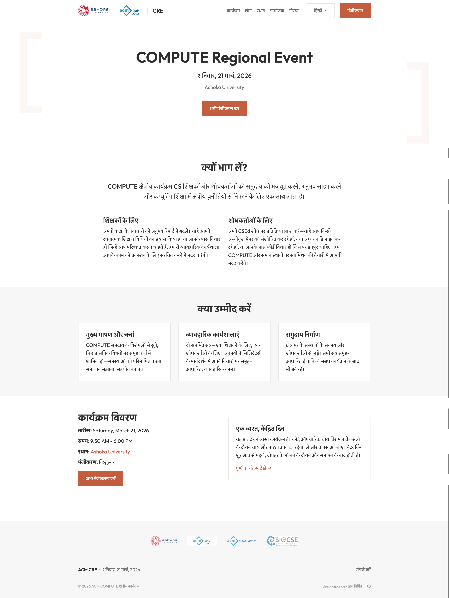

# ACM COMPUTE Regional Event Template

A Jekyll template for ACM COMPUTE Regional Events. Use this template to create your own regional event website.

<p>
  
  
</p>

## Features

- **Jekyll + GitHub Pages** compatible (no build step required)
- **Bootstrap 5** with full Sass customisation
- **WCAG 2.1 AA** accessible
- **Bilingual support** (English + Hindi) with proper i18n architecture
- **Data-driven** — configure everything via YAML files
- **Mobile-first** responsive design

## Documentation

For complete setup instructions, customisation guides, and deployment information, visit:

**[https://acm-cre.github.io/docs/](https://acm-cre.github.io/docs/)**

## Quick Start

1. Click "Use this template" to create your own repository
2. Configure your event in `_data/config/` and `_data/content/`
3. Replace placeholder images in `assets/images/organisers/`
4. Deploy to GitHub Pages

See the [documentation](https://acm-cre.github.io/docs/) for detailed instructions.

## Project Structure

```
├── _config.yml           # Jekyll configuration
├── _data/
│   ├── config/           # Site and event configuration
│   │   ├── site.yml      # Event name, date, location, social links
│   │   ├── navigation.yml
│   │   └── organisers.yml
│   ├── content/          # Event content
│   │   ├── schedule.yml
│   │   ├── sponsors.yml
│   │   └── speakers/
│   └── strings/          # UI translations
│       ├── en.yml
│       └── hi.yml
├── _includes/
│   ├── layout/           # Header, footer, head
│   ├── components/       # Schedule, speakers, sponsors
│   └── utilities/        # Language switcher
├── _layouts/
│   ├── default.html      # Base layout
│   ├── home.html         # Home page layout
│   └── flyer.html        # Print-optimized flyer layout
├── _pages/               # English pages
├── _sass/
│   ├── _variables.scss   # Theme customisation
│   ├── _bootstrap.scss   # Bootstrap imports
│   └── _custom.scss      # Custom styles
├── assets/
│   ├── css/
│   ├── images/
│   │   ├── organisers/   # Host and partner logos
│   │   ├── sponsors/     # Sponsor logos
│   │   ├── speakers/     # Speaker photos
│   │   └── flyers/       # Flyer preview images
│   └── downloads/        # Downloadable PDFs (flyers)
├── hi/                   # Hindi pages
├── index.md              # English home page
├── 404.html              # Error page
└── robots.txt            # Search engine config
```

## License

MIT License — see [LICENSE](LICENSE) for details.

## Credits

Built with:
- [Jekyll](https://jekyllrb.com/)
- [Bootstrap 5](https://getbootstrap.com/)
- [GitHub Pages](https://pages.github.com/)

---

Made with care for the ACM COMPUTE community
